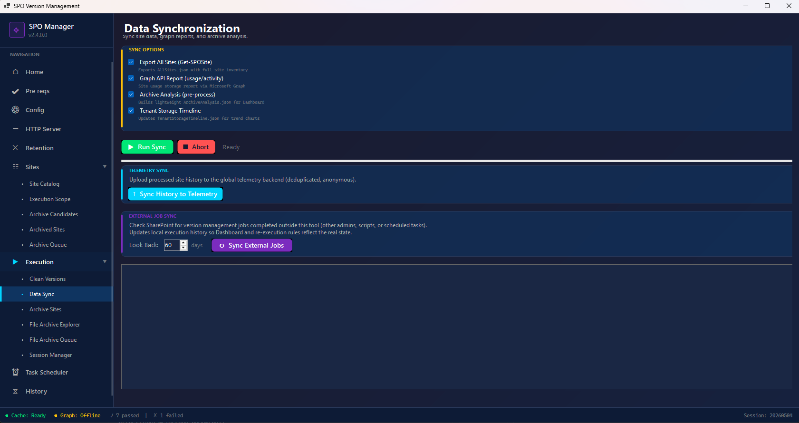

# Quick Start Guide

> Step-by-step: from download to your first storage cleanup in minutes.

**Full online version:** [ivanoliv.github.io/SPOVersionManagement/guides/quick-start/](https://ivanoliv.github.io/SPOVersionManagement/guides/quick-start/)

---

## Prerequisites

| Requirement | Details |
|-------------|---------|
| **Windows** | Windows 10/11 or Windows Server 2016+ |
| **.NET 10 Desktop Runtime** | [Download](https://dotnet.microsoft.com/download/dotnet/10.0) (required for the GUI app) |
| **PowerShell 7** | [Download](https://github.com/PowerShell/PowerShell/releases) (required for script execution) |
| **SharePoint Admin role** | SharePoint Administrator or Global Administrator |

### Authentication — Entra ID App (Recommended)

Configure an **Entra ID app registration** with a certificate for app-only (unattended) authentication. This allows the tool to run silently — no browser prompts, no MFA popups, and works for scheduled/unattended runs.

**Without an app registration:** the tool falls back to interactive login. You will be prompted to sign in with your admin account **every time you run the tool** (every sync, every execution). Works for testing, impractical for regular use.

➡️ [Entra ID App Setup Guide](ENTRA_ID_APP_SETUP.md) (~10 minutes to configure)

---

## Step 1 — Download and Install

1. Download the latest `.zip` from [GitHub Releases](https://github.com/ivanoliv/SPOVersionManagement/releases)
2. Install [.NET 10 Desktop Runtime](https://dotnet.microsoft.com/download/dotnet/10.0) if not already installed
3. Extract the ZIP to a folder (e.g., `C:\Tools\SPOVersionManagement`)
4. Run **`SPOVersionManagement.exe`**

---

## Step 2 — Configure Your Tenant

Go to **Config** in the left menu.


Fill in:

1. **Admin URL** — `https://YOURTENANT-admin.sharepoint.com`
2. **Entra ID App Registration:**
   - **Tenant ID** — From your Entra ID app registration
   - **Client ID** — Application (client) ID
   - **Certificate Thumbprint** — The certificate uploaded to the app
3. Click **Save**

---

## Step 3 — Sync Your Tenant Data

Go to **Execution → Data Sync**.



1. Check the sync options:
   - ☑️ **Export All Sites** — Full site inventory
   - ☑️ **Graph API Report** — Storage data from Microsoft Graph
   - ☑️ **Archive Analysis** — Dashboard analysis data
   - ☑️ **Tenant Storage Timeline** — Trend charts
2. Click **Run Sync**

> **Large tenants (100K+ sites):** First `Get-SPOSite` can take 30+ minutes. After the first sync, check **"Use AllSites.json cache"** on the execution screen to skip re-exporting.

### If you don't have Graph API permissions

You can export the report manually from the Microsoft 365 Admin Center:

1. Go to [admin.cloud.microsoft](https://admin.cloud.microsoft)
2. Navigate to **Reports → Use → SharePoint → "Use of websites"**
3. Change the time period to **Last 180 days** (top-right)
4. Click **Export** (↓) on the **Storage** box (third box)
5. Save the CSV file
6. In the GUI, check **☑️ Skip Graph** and set **Graph Report (CSV)** to the downloaded file

---

## Step 4 — View Your Dashboard

Go to **HTTP Server** in the left menu and start the server.

Open **http://localhost:8080** in your browser.

You'll see: site list, version counts, storage metrics, potential savings, archive candidates.

This is your **read-only assessment** — nothing has been changed yet.

---

## Step 5 — Run Version Cleanup

Go to **Execution → Clean Versions**.


### Configure

| Setting | Recommended | Description |
|---------|-------------|-------------|
| **Major Versions** | 5 | Versions to keep per file |
| **Minor Versions** | 0 | Minor versions to keep |
| **Zero Version Action** | Skip | Skip files with 0 versions |
| **Re-execution Days** | 60 | Skip recently processed sites |
| **Concurrent Jobs** | 100 | Parallel jobs |

### Operation Mode (top-right)

- ☑️ **Delete Excess Versions** — Main cleanup operation
- ☐ **Sync Version Policy** — Push version limits to all sites
- ☐ **Manage Retention Policies** — Handle retention holds (requires Purview app)
- ☐ **Skip Graph** — Use manual CSV instead of Graph API

### Execute

Click **Execute** (green button). Monitor progress in the output panel.

> **Safety:** Uses official Microsoft APIs only. Never touches the current file version or content.

---

## Step 6 — Review Results

1. Run **Data Sync** again to refresh dashboard data
2. Open **http://localhost:8080** to see storage freed, versions deleted, and cost savings

---

## PowerShell Alternative

```powershell
cd C:\Tools\SPOVersionManagement

# Sync data only (assessment)
.\Start-SPOVersionManagement.ps1 -AdminUrl "https://contoso-admin.sharepoint.com" -SyncOnly

# Start dashboard
.\Start-Dashboard.ps1

# Run cleanup — keep 5 major versions
.\Start-SPOVersionManagement.ps1 -AdminUrl "https://contoso-admin.sharepoint.com" -MajorVersionLimit 5

# Unattended mode (scheduled tasks)
.\Start-SPOVersionManagement.ps1 -AdminUrl "https://contoso-admin.sharepoint.com" -MajorVersionLimit 5 -Unattended

# With manual Graph report (no Graph permissions)
.\Start-SPOVersionManagement.ps1 -AdminUrl "https://contoso-admin.sharepoint.com" -MajorVersionLimit 5 -SkipGraph -GraphReportCSV "C:\path\to\report.csv"
```

---

## What's Next?

- **Schedule cleanup** — Use Task Scheduler in the GUI for automated runs
- **Monitor regrowth** — Tenant Storage Timeline shows trends over time
- **Archive inactive sites** — Use Archive Sites for dormant content
- **Set up Purview** — Configure retention policy handling ([guide](ENTRA_ID_APP_SETUP.md#app-2-purview-app-retention-policy-management))

---

## Need Help?

- [Full Online Documentation](https://ivanoliv.github.io/SPOVersionManagement/guides/)
- [Report an Issue](https://github.com/ivanoliv/SPOVersionManagement/issues)
