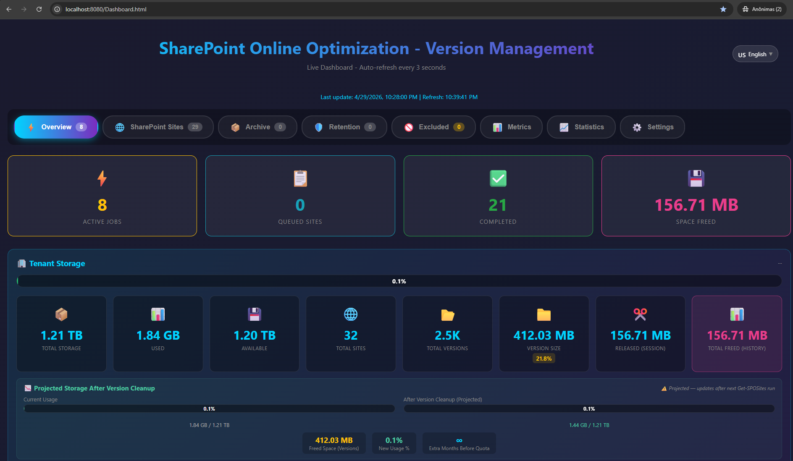
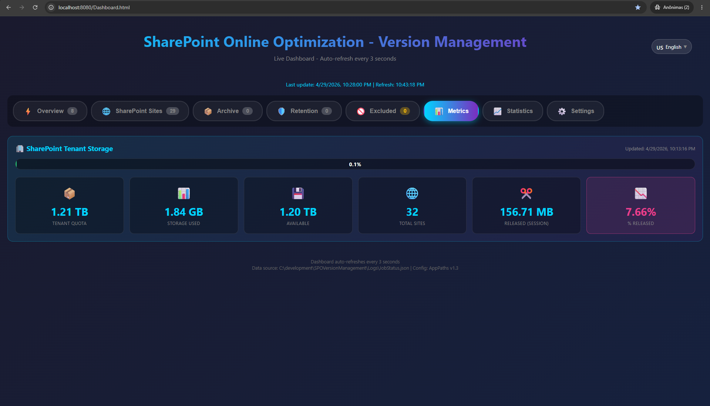
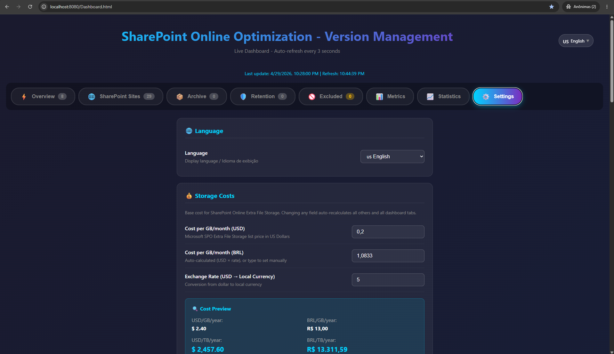
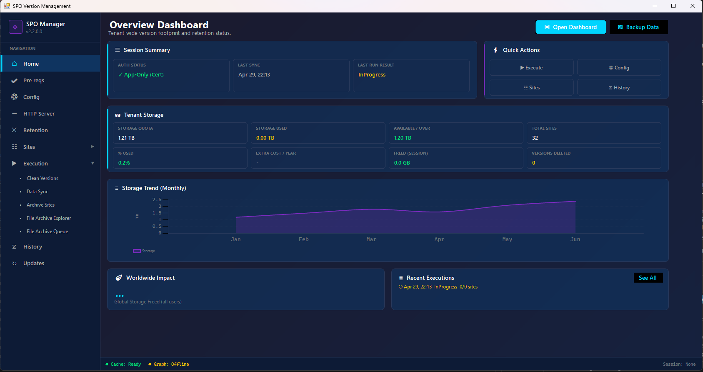
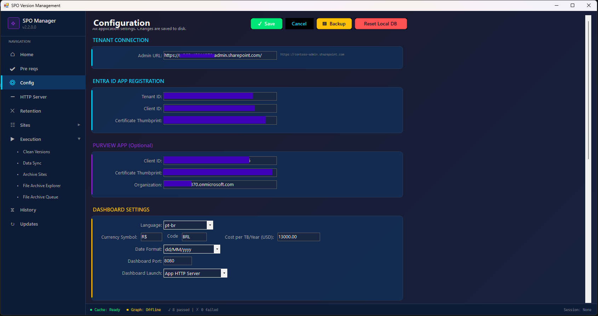
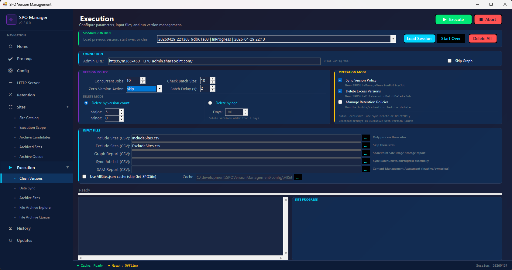
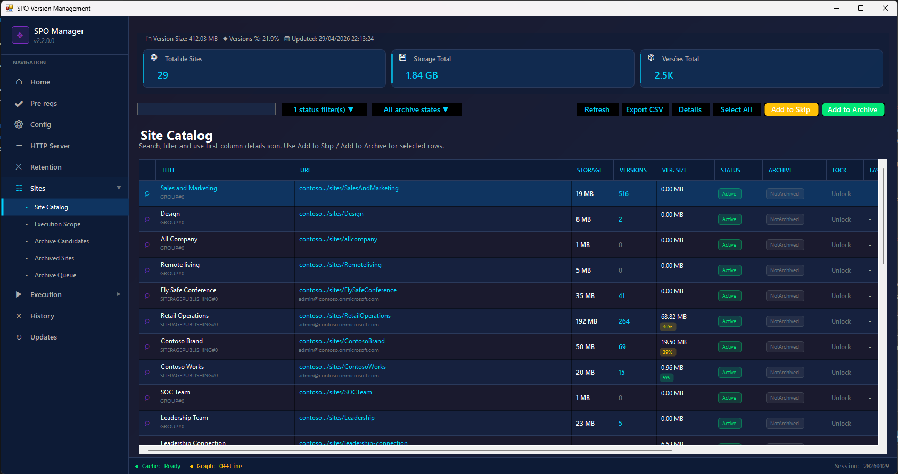

# SPO Version Management

> Automated storage optimization for SharePoint Online — reduce unnecessary costs, reclaim wasted capacity, and bring governance to version history at scale.

[](https://docs.microsoft.com/powershell/)
[](https://www.microsoft.com/microsoft-365/sharepoint/)
[](LICENSE)
[](https://github.com/ivanoliv/SPOVersionManagement/releases)

**👤 Author:** Ivan Oliveira — Senior Cloud Solution Architect at Microsoft | Microsoft 365 & SharePoint specialist focused on storage optimization, governance, and tenant-scale automation. — [@ivanoliv](https://github.com/ivanoliv)

> **⚠️ Disclaimer:** This is an independent, community-driven project. It is **not** affiliated with, endorsed by, or supported by Microsoft Corporation. Microsoft provides no guarantees, warranties, or support of any kind for this tool. Use at your own risk. See [Disclaimer](#-disclaimer) for full details.

---

## The Problem

SharePoint Online storage grows silently. Most organizations don't realize that a significant portion of their consumed storage is not active business content — it's **accumulated file versions** that serve no operational or compliance purpose.

Common storage growth drivers include:

- **Uncontrolled version history** — Document libraries retaining hundreds of versions per file with no upper limit configured
- **No lifecycle governance** — Sites and content persist indefinitely without ownership review or disposition
- **Misaligned retention policies** — Retention configurations that prevent cleanup even when content has no legal or business hold
- **Inactive sites with large footprints** — Abandoned team sites, project sites, and communication sites still consuming storage
- **Reactive storage purchasing** — Organizations buying Microsoft 365 Extra File Storage instead of identifying and removing waste

The result: recurring and growing costs for storage that delivers no business value, while the environment becomes harder to govern and less suitable for AI-powered scenarios like Microsoft Copilot (which performs better against clean, well-governed content).

---

## The Solution

SPO Version Management is a **production-grade automation suite** (PowerShell + WinForms GUI) that identifies, quantifies, and remediates excessive storage consumption in SharePoint Online — with a primary focus on **version history optimization**.

It uses the official SharePoint Online Management Shell APIs (`New-SPOSiteManageVersionPolicyJob`, `New-SPOSiteFileVersionBatchDeleteJob`) to:

1. **Set version limits** across all sites in the tenant (SyncListPolicy phase)
2. **Purge excess historical versions** that exceed the configured limits (BatchDelete phase)
3. **Monitor and report** on progress, savings, and execution history in real time

The tool handles the full lifecycle: discovery → policy enforcement → version deletion → monitoring → reporting — with parallel execution, automatic retry, retention policy suspension/resume, and comprehensive dashboards.

---

## How It Works

```
┌──────────────────────────────────────────────────────────────────┐
│  1. DISCOVER        Enumerate all SPO sites via Admin API        │
│  2. FILTER          Apply inclusion/exclusion rules              │
│  3. SYNC POLICY     Set version limits (e.g., 20 major versions)│
│  4. BATCH DELETE    Purge versions exceeding the new limits      │
│  5. MONITOR         Track job progress in real time              │
│  6. REPORT          Dashboard + CSV exports for Power BI         │
└──────────────────────────────────────────────────────────────────┘
```

- **Parallel execution** — Up to 10 simultaneous jobs with automatic queue management
- **Retention-aware** — Automatically suspends/resumes retention policies that block deletion
- **Resumable** — Pick up where you left off after interruptions
- **Non-destructive by default** — SyncOnly mode for assessment without changes

---

## Expected Outcomes

| Outcome | Description |
|---------|-------------|
| **Storage reclamation** | Typically 20–60% reduction in version-related storage consumption |
| **Cost avoidance** | Reduce or eliminate need for Microsoft 365 Extra File Storage purchases |
| **Policy enforcement** | Consistent version limits applied across the entire tenant |
| **Governance baseline** | Visibility into site activity, storage distribution, and version patterns |
| **Copilot readiness** | Cleaner content corpus with less redundant/obsolete data for AI indexing |
| **Operational visibility** | Real-time dashboards and Power BI–ready exports for ongoing monitoring |

---

## Key Capabilities

| Component | What it does |
|-----------|--------------|
| **PowerShell Module** | Core engine — parallel job orchestration, policy sync, batch deletion |
| **HTML Dashboard** | Real-time browser UI — charts, status badges, storage trends, settings |
| **WinForms GUI App** | Desktop application — configuration, execution control, prerequisites check |
| **Retention Manager** | Suspend/resume retention policies blocking version cleanup |
| **File Archive Search** | Identify large files by extension category across the tenant |
| **Power BI Export** | CSV execution history and site storage data for advanced analytics |

---

## Who This Is For

- **SharePoint Administrators** managing tenants with growing storage pressure
- **Microsoft 365 Governance teams** implementing lifecycle controls
- **IT Cost Optimization** initiatives targeting recurring storage spend
- **Copilot readiness programs** that need cleaner, well-governed content
- **Managed Service Providers** running storage optimization across multiple customers

---

## Quick Start

```powershell
# 1. Install (Option A: PowerShell script)
.\Install-SPOVersionManagement.ps1

# 1. Install (Option B: From the GUI app)
#    Open SPOVersionManagement.exe → Updates panel → "Update Scripts Folder" → specify path → OK

# 2. Configure credentials (GUI, Dashboard, or edit config\AppPaths.json)
#    See ENTRA_ID_APP_SETUP.md for app registration guide

# 3. Run assessment (no changes, data collection only)
.\Start-SPOVersionManagement.ps1 -AdminUrl "https://contoso-admin.sharepoint.com" -SyncOnly

# 4. Run full optimization (set policies + delete excess versions)
.\Start-SPOVersionManagement.ps1 -AdminUrl "https://contoso-admin.sharepoint.com" -MajorVersionLimit 20

# 5. Monitor progress
.\Start-Dashboard.ps1
```

---

## Screenshots

### HTML Dashboard — Execution Monitor


### HTML Dashboard — Storage Analytics


### HTML Dashboard — Settings


### Windows GUI App — Home


### Windows GUI App — Configuration


### Windows GUI App — Execution


### Windows GUI App — Site Catalog


> 📸 Screenshots are in `docs/screenshots/`.

---

## 📋 Table of Contents

- [Features](#-features)
- [New in v2.0](#-new-in-v20)
- [Requirements](#-requirements)
- [Installation](#-installation)
- [Quick Start](#-quick-start)
- [Configuration](#-configuration)
- [Dashboard](#-html-dashboard)
- [Advanced Features](#-advanced-features)
- [Troubleshooting](#-troubleshooting)
- [Changelog](#-changelog)

---

## ✨ Features

### Core Capabilities
- **Parallel Execution**: Up to 10 simultaneous jobs with automatic orchestration
- **Two-Phase Processing**: SyncListPolicy → BatchDelete workflow
- **Smart Queue Management**: Automatic job scheduling and monitoring
- **Execution Resume**: Continue where you left off after interruption

### Dashboard & Monitoring
- **Interactive HTML Dashboard**: Real-time monitoring with charts and statistics
- **Multi-language Support**: English and Portuguese localization
- **Phase Badges**: Visual status indicators (SYNC ✓, DELETE ✓, DELETE -)
- **Site Execution History**: Complete tracking with detailed popup
- **Storage Analytics**: Trend charts and savings calculations

### Filtering & Control
- **Inclusion/Exclusion Filters**: CSV-based granular control
- **Reexecution Interval**: Skip recently processed sites (configurable)
- **Zero Version Handling**: Smart handling of sites with no versions to delete
- **Session Management**: Multiple session support with history

### Integration
- **Graph API Integration**: Last Activity data and storage history
- **External Job Sync**: Capture results from other scripts
- **Power BI Ready**: CSV exports for advanced reporting
- **Smart Cache**: Optional cached data with refresh capability

---

## 🆕 New in v2.0

### Dashboard Enhancements
- **Phase Badges**: Individual status badges for SYNC and DELETE phases
  - `SYNC ✓` - Sync completed successfully
  - `SYNC 🔄` - Sync in progress
  - `DELETE ✓` - Delete completed successfully
  - `DELETE -` - Delete skipped (zero versions)
  - `DELETE ⏳` - Delete pending
- **Accurate Status Display**: Sites with skipped deletes show as COMPLETE (not PARTIAL)
- **BATCHDELETE Box**: Shows "Skipped" instead of "Waiting..." for zero-version sites

### Reexecution Interval
- **Configurable Interval**: Skip sites processed within X days (0-30)
- **Ask Mode**: Prompt for each recently processed site
- **Dashboard Settings**: Configure via Settings tab
- **Options**: Process All / Skip All / Ask

### External Job Sync
- **Sync-ExternalJobResults**: Capture job results from other scripts
- **Automatic Detection**: Finds completed jobs from last 7 days
- **Dashboard Integration**: External jobs appear in Recently Completed
- **No Duplicate Processing**: Tracks external executions properly

### Session Management
- **Previous Session Summary**: Shows Completed/Active/Pending counts on resume
- **Skipped Jobs Tracking**: Separate counter for skipped sites
- **Status Line**: "X active | Y queued | Z completed | W skipped"
- **Cancelled Sessions**: Ability to cancel old pending sessions

### Bug Fixes
- Fixed URL normalization for reexecution check (case-insensitive)
- Fixed array vs hashtable initialization for job tracking
- Fixed PARTIAL badge showing for completed sync-only sites
- Fixed "Waiting..." showing when delete was intentionally skipped

---

## 📋 Requirements

### PowerShell
- PowerShell 5.1 **and** PowerShell 7+ (PnP.PowerShell requires 7+)
- Windows PowerShell 5.1 for SPO Management Shell cmdlets

### Required Modules
```powershell
# SharePoint Online Management Shell
Install-Module -Name Microsoft.Online.SharePoint.PowerShell -Force

# Microsoft Graph (optional, for additional data)
Install-Module -Name Microsoft.Graph -Force
```

### Permissions
| Service | Required Role |
|---------|---------------|
| SharePoint Online | SharePoint Administrator or Global Administrator |
| Microsoft Graph | `Sites.Read.All`, `Reports.Read.All` |

### SharePoint Online Cmdlets Used
- `Get-SPOSite`
- `New-SPOSiteManageVersionPolicyJob`
- `Get-SPOSiteManageVersionPolicyJobProgress`
- `New-SPOSiteFileVersionBatchDeleteJob`
- `Get-SPOSiteFileVersionBatchDeleteJobProgress`

---

## 📁 File Structure

```
SPOVersionManagement\
├── SPOVersionManagement.psm1      # Main module with all functions
├── SPOSiteFilters.psm1            # Inclusion/exclusion filter module
├── SPORetentionPolicyManager.psm1 # Retention policy management module
├── Start-SPOVersionManagement.ps1 # Main execution script
├── Start-SPOVersionManagement_app.ps1 # Launch WinForms GUI app
├── Start-Dashboard.ps1            # Opens Dashboard in browser
├── Start-FileArchiveSearch.ps1    # File archive search by extension
├── Start-ArchiveWebsites.ps1     # Archive websites execution
├── Import-SamUnusedSites.ps1     # Import SAM unused sites report
├── Export-AllSPOSites.ps1         # Exports list of all sites
├── Reset-SPOVersionManagement.ps1 # Reset to deploy state
├── Rebuild-SiteExecutionHistory.ps1 # Rebuilds history from CSV
├── Connect-SPOFirst.ps1           # Helper connection script
├── Install-SPOVersionManagement.ps1 # Installer (preserves configs)
├── Build-DeployPackage.ps1        # Build deployment ZIP
├── IncludeSites.csv               # List of sites to process (optional)
├── ExcludeSites.csv               # List of sites to exclude (optional)
├── SharePointSiteUsageStorage PM.csv # Graph storage report template
├── README.md                       # This documentation
├── src\                            # WinForms GUI application (C#)
│   └── SPOVersionManagement\      # .NET Framework 4.8 project
├── config\
│   ├── AppPaths.json              # Centralized path configuration
│   ├── DashboardConfig.json       # Dashboard settings
│   ├── ExtensionGroups.json       # File archive extension categories
│   ├── AllSites.json              # Cache of all sites data
│   ├── JobStatus.json             # Real-time job status
│   ├── TenantStorage.json         # Tenant storage status
│   ├── ExcludedSites.json         # List of excluded sites
│   └── SiteExecutionHistory.json  # Site execution history
├── web\
│   ├── Dashboard.html             # Interactive HTML Dashboard
│   └── localization.js            # Translation file (EN/PT)
└── Logs\
    ├── ExecutionHistory.csv       # Complete history for Power BI
    ├── SiteStorage.csv            # Site storage data
    └── Execution_*.csv            # Individual logs per execution
```

## 🚀 How to Use

### 1. Prerequisites

```powershell
# Install required modules
Install-Module -Name Microsoft.Online.SharePoint.PowerShell -Force
Install-Module -Name Microsoft.Graph -Force
```

### 2. Main Execution

```powershell
# Process all tenant sites with default limits (4 versions)
.\Start-SPOVersionManagement.ps1 -AdminUrl "https://contoso-admin.sharepoint.com"

# Process with 20 version limit and open Dashboard
.\Start-SPOVersionManagement.ps1 `
    -AdminUrl "https://contoso-admin.sharepoint.com" `
    -MajorVersionLimit 20 `
    -MajorWithMinorVersionsLimit 20 `
    -OpenDashboard

# Process only sites from a CSV list
.\Start-SPOVersionManagement.ps1 `
    -AdminUrl "https://contoso-admin.sharepoint.com" `
    -InputSiteListCSV ".\IncludeSites.csv"

# Process all EXCEPT sites from a list
.\Start-SPOVersionManagement.ps1 `
    -AdminUrl "https://contoso-admin.sharepoint.com" `
    -InputExclusionSiteListCSV ".\ExcludeSites.csv"

# Skip Graph connection (faster, less data)
.\Start-SPOVersionManagement.ps1 `
    -AdminUrl "https://contoso-admin.sharepoint.com" `
    -SkipGraphConnection
```

### 3. Available Parameters

| Parameter | Description | Default |
|-----------|-------------|---------|
| `-AdminUrl` | SPO Admin Center URL | (required) |
| `-InputSiteListCSV` | CSV file with site URLs to process | (all sites) |
| `-InputExclusionSiteListCSV` | CSV file with site URLs to EXCLUDE | (none) |
| `-MajorVersionLimit` | Major version limit to keep | 4 |
| `-MajorWithMinorVersionsLimit` | Minor version limit to keep | 4 |
| `-MaxConcurrentJobs` | Maximum simultaneous jobs | 10 |
| `-SkipGraphConnection` | Skip Microsoft Graph connection | $false |
| `-OpenDashboard` | Open Dashboard in browser on start | $false |

### 4. CSV File Format

The inclusion/exclusion CSV file must have a `SiteUrl` or `Url` column:

```csv
SiteUrl
https://contoso.sharepoint.com/sites/Site1
https://contoso.sharepoint.com/sites/Site2
https://contoso.sharepoint.com/sites/Site3
```

## 📊 HTML Dashboard

The Dashboard provides a complete view of the processing:

### Available Tabs

1. **Dashboard**: Tenant overview (storage, quota, trends)
2. **Active Jobs**: Jobs currently running
3. **Queue**: Sites awaiting processing (Sync/Delete)
4. **Completed**: History of finished jobs with filters
5. **SharePoint Sites List**: Complete site list with metrics
6. **Excluded Sites**: Sites protected from processing
7. **Archived**: Archived sites in the tenant

### Dashboard Features

- **Auto-refresh** configurable (5s to 5min)
- **Filters and sorting** on all tables
- **Trend charts** for storage consumption
- **Site execution history** with detailed popup
- **Data export** (CSV)
- **Estimated savings calculation** ($13,000/TB/year)

### Open the Dashboard

```powershell
# Via script
.\Start-Dashboard.ps1

# Or open directly
Start-Process ".\web\Dashboard.html"

# Or use -OpenDashboard parameter in main script
.\Start-SPOVersionManagement.ps1 -AdminUrl "..." -OpenDashboard
```

## 🔧 Centralized Configuration

The `config\AppPaths.json` file centralizes all application paths and credentials.

### Configuring Credentials (ClientId, TenantId, Thumbprint)

Credentials can be entered in **3 ways** — all write to the same `config\AppPaths.json`:

| Method | How |
|--------|-----|
| **JSON file** | Edit `config\AppPaths.json` directly (see [ENTRA_ID_APP_SETUP.md](ENTRA_ID_APP_SETUP.md)) |
| **Dashboard** | Open Dashboard → Settings tab → SPO/Purview App sections |
| **GUI App** | Launch `SPOVersionManagement.exe` → Configuration tab |

### Path Configuration

```json
{
    "Version": "1.3",
    "Files": {
        "JobStatus": "JobStatus.json",
        "TenantStorage": "TenantStorage.json",
        "AllSites": "AllSites.json",
        "SiteExecutionHistory": "SiteExecutionHistory.json",
        ...
    }
}
```

To access paths via PowerShell:

```powershell
Import-Module .\SPOVersionManagement.psm1
$paths = Get-SPOAppPaths
$paths.JobStatusFile       # Full path to JobStatus.json
$paths.AllSitesFile        # Full path to AllSites.json
```

## 🔄 Execution Flow

```
┌─────────────────────────────────────────────────────────────┐
│                    INITIALIZATION                           │
│  • Connect to SPO Admin                                     │
│  • Connect to Microsoft Graph (optional)                    │
│  • Load inclusion/exclusion filters                         │
│  • Check previous execution (resume?)                       │
│  • Update tenant status                                     │
└─────────────────────────────────────────────────────────────┘
                              │
                              ▼
┌─────────────────────────────────────────────────────────────┐
│                    PHASE 1: SYNC POLICY                     │
│  • Execute New-SPOSiteManageVersionPolicyJob -SyncListPolicy│
│  • Maximum N simultaneous jobs (configurable)               │
│  • Monitor until CompleteSuccess                            │
│  • Save site execution history                              │
└─────────────────────────────────────────────────────────────┘
                              │
                              ▼
┌─────────────────────────────────────────────────────────────┐
│                    PHASE 2: BATCH DELETE                    │
│  • Execute New-SPOSiteFileVersionBatchDeleteJob             │
│  • Apply configured version limits                          │
│  • Monitor and record released storage                      │
│  • Save site execution history                              │
└─────────────────────────────────────────────────────────────┘
                              │
                              ▼
┌─────────────────────────────────────────────────────────────┐
│                    FINALIZATION                             │
│  • Update JSON files for Dashboard                          │
│  • Update CSVs for Power BI                                 │
│  • Display summary in console                               │
└─────────────────────────────────────────────────────────────┘
```

##  Advanced Features

### Reexecution Interval Configuration

Control how the script handles recently processed sites:

```powershell
# In DashboardConfig.json
{
    "ReexecutionDays": 7,      # Skip sites processed in last 7 days
    "ZeroVersionAction": "syncOnly"  # Handle zero-version sites
}
```

**ReexecutionDays Options:**
| Value | Behavior |
|-------|----------|
| `0` | Process all sites (disable check) |
| `1-30` | Skip sites processed within X days |
| `"ask"` | Prompt for each recently processed site |

**ZeroVersionAction Options:**
| Value | Behavior |
|-------|----------|
| `"ask"` | Prompt user for action |
| `"skip"` | Skip zero-version sites entirely |
| `"syncOnly"` | Run sync only, skip delete phase |
| `"processAll"` | Process all sites normally |

### External Job Synchronization

Capture job results from scripts run outside this tool:

```powershell
# Automatically runs at startup, or call manually:
Import-Module .\SPOVersionManagement.psm1
Sync-ExternalJobResults -Sites $mySites -DaysToCheck 7
```

This function:
1. Checks `Get-SPOSiteFileVersionBatchDeleteJobProgress` for each site
2. Checks `Get-SPOSiteManageVersionPolicyJobProgress` for each site
3. Imports completed jobs from the last N days
4. Updates Dashboard to show accurate status

### Session Management

The script maintains session history for tracking and resume:

```powershell
# View pending sessions
Get-PendingSessions

# Resume specific session
.\Start-SPOVersionManagement.ps1 -AdminUrl "..." -Resume
```

**Session Status Values:**
- `InProgress` - Session is active
- `Completed` - Session finished successfully  
- `Cancelled` - Session was manually cancelled

### Dashboard Configuration

Settings are stored in `config\DashboardConfig.json`:

```json
{
    "RefreshIntervalSeconds": 5,
    "Language": "en",
    "ReexecutionDays": 7,
    "ZeroVersionAction": "syncOnly",
    "Theme": "dark"
}
```

Configure via Dashboard Settings tab or edit JSON directly.

---

## ⚠️ Important Notes

1. **Credentials**: The script uses interactive authentication. For automation, consider using certificates or managed identity.

2. **Throttling**: SPO may apply throttling if too many requests are made. The 30s polling helps avoid this.

3. **Backup**: Always test in a development environment before running in production.

4. **Performance**: Use `-SkipGraphConnection` for faster executions when Graph data is not needed.

5. **Cache**: The system stores data in cache (AllSites.json). Use the "Refresh" option when needed.

6. **Resume**: If execution is interrupted, the system offers the option to continue where it left off.

## 🐛 Troubleshooting

### Graph connection error
```powershell
# Check and reconnect
Disconnect-MgGraph
Connect-MgGraph -Scopes "Sites.Read.All", "Reports.Read.All"
```

### Job stuck in "InProgress"
```powershell
# Check status manually
Get-SPOSiteManageVersionPolicyJobProgress -Identity "https://site.sharepoint.com/sites/xxx"
Get-SPOSiteFileVersionBatchDeleteJobProgress -Identity "https://site.sharepoint.com/sites/xxx"
```

### Dashboard not updating
- Check if JSON files are being generated in the `config\` and `Logs\` folders
- Try reloading the page (F5)
- Check browser console (F12) for errors

### Required permissions
- **SharePoint**: SharePoint Administrator or Global Administrator
- **Graph API**: 
  - `Sites.Read.All` - To read site data
  - `Reports.Read.All` - For storage history

## 🌐 Localization / Internationalization

The Dashboard supports multiple languages. To switch between languages:

1. **In Header**: Click the language selector (flag) in the upper right corner
2. **In Settings**: Use the language dropdown in the Settings tab

### Supported Languages
- 🇺🇸 English (en)
- 🇧🇷 Português (pt)

### Adding Translations

Translations are in the `web/localization.js` file. To add a new string:

```javascript
"translation.key": {
    en: "English text",
    pt: "Portuguese text"
},
```

To use in HTML:
```html
<span data-i18n="translation.key">Fallback text</span>
```

To use in JavaScript:
```javascript
const text = t('translation.key');
// With parameters: t('key', param1, param2) - uses {0}, {1} in text
```

---

## 📄 CSV Files Reference

### ExcludeSites.csv

Sites to **exclude** from version management processing. The script skips any site listed here.

| Column | Description |
|--------|-------------|
| `SiteURL` | Full SharePoint site URL (e.g., `https://contoso.sharepoint.com/sites/Legal`) |
| `SiteName` | Friendly name for reference (optional but recommended) |
| `Reason` | Why the site is excluded (e.g., "Under legal hold", "Recently migrated") |

```csv
SiteURL,SiteName,Reason
https://contoso.sharepoint.com/sites/Legal,Legal Team,Under legal hold
https://contoso.sharepoint.com/sites/Archive,Archive,Already archived
```

### IncludeSites.csv

When provided, **only** these sites will be processed (whitelist mode). If empty, all tenant sites are processed.

| Column | Description |
|--------|-------------|
| `SiteURL` | Full SharePoint site URL to process |

```csv
SiteURL
https://contoso.sharepoint.com/sites/Finance
https://contoso.sharepoint.com/sites/HR
```

### SharePointSiteUsageStorage PM.csv

Tenant-level storage usage timeline from Microsoft Graph API. Used by the Dashboard for storage trend charts.

| Column | Description |
|--------|-------------|
| `Report Refresh Date` | Date when Microsoft refreshed this data |
| `Site Type` | Always "All" for tenant aggregate |
| `Storage Used (Byte)` | Total storage consumed in bytes |
| `Report Date` | The specific date this measurement represents |
| `Report Period` | Reporting window in days (typically 180) |

**How to obtain:**
1. **Via Graph API** (automated): `Get-MgReportSharePointSiteUsageStorage -Period D180`
2. **Via Admin Center** (manual): Microsoft 365 Admin > Reports > Usage > SharePoint > Site usage > Storage

---

## 🔎 File Archive Search

The File Archive Search feature (`Start-FileArchiveSearch.ps1`) scans SharePoint sites for files matching specific extension categories using Microsoft Graph Search API.

### Extension Groups Configuration

Categories are loaded from `config\ExtensionGroups.json`. Each group has:
- **Name**: Category display name
- **Color**: Hex color for UI display
- **Enabled**: Whether to include in searches (true/false)
- **Extensions**: Array of file extensions to match

```json
{
  "Groups": [
    { "Name": "Video", "Color": "#ff5722", "Enabled": true, "Extensions": [".mp4", ".mov", ".wmv", ".avi"] },
    { "Name": "Audio", "Color": "#9c27b0", "Enabled": true, "Extensions": [".mp3", ".wav", ".flac"] },
    { "Name": "CAD",   "Color": "#795548", "Enabled": true, "Extensions": [".dwg", ".dxf", ".step"] }
  ]
}
```

Edit this file directly or use the GUI (File Archive panel > Extension Groups tab) to enable/disable categories and manage extensions.

If `ExtensionGroups.json` is missing or empty, built-in defaults are used (Video, Audio, Image, Design, CAD).

---

## 🔒 Telemetry & Privacy

### What is sent

The application sends **anonymous usage telemetry** to help improve the product:
- Session start/end timestamps
- Number of sites processed per session
- Storage released (aggregate, no site names)
- Feature usage flags (which panels/features are used)
- Application version

### What is NOT sent
- Site URLs or site names
- User names or email addresses
- File names or document content
- Tenant domain name

### Tenant ID Protection

The tenant identifier is **one-way hashed** (SHA-256) before transmission. The original tenant ID cannot be recovered from the hash. This allows aggregate statistics per organization without exposing the actual tenant identity.

```
Original: 3f2504e0-4f89-11d3-9a0c-0305e82c3301
Transmitted: a8b4c2... (SHA-256 hash, irreversible)
```

Telemetry can be disabled in `config\AppPaths.json` by setting `"TelemetryEnabled": false`.

---

## 📝 Changelog

> Full changelog with all versions: **[CHANGELOG.md](CHANGELOG.md)**

### v2.3.0.0 (2026-04-29) - Current
**Release: GUI Persistence, Telemetry Backend Deployment & Bug Fixes**

> 🤖 *AI Summary:* This release stabilizes the Windows GUI with persistent settings, native prompt dialogs, and multiple crash/UX fixes. The telemetry backend is now live on Azure App Service, and the GitHub Pages landing page displays real-time worldwide savings data.

#### Highlights
- **GUI Settings Persistence** — All execution panel fields survive app restarts
- **Dynamic PowerShell Prompts** — Read-Host and PromptForChoice render as native WinForms dialogs
- **Telemetry Backend Live** — Azure App Service deployment with CORS and detailed stats API
- **Bug Fixes** — Duplicate output, SplitterDistance crash, aggressive refresh, PII removal

See [CHANGELOG.md](CHANGELOG.md) for full details.

---

### v2.2.0.0 (2026-04-29)
**Release: Windows GUI Orchestration, Telemetry & Documentation Overhaul**

#### New Features
- **Phase Badges System**
  - Individual SYNC and DELETE status badges
  - Visual indicators: ✓ (done), 🔄 (running), ⏳ (pending), ⚠️ (error), - (skipped)
  - Clear distinction between completed and in-progress phases
  
- **External Job Sync (`Sync-ExternalJobResults`)**
  - Automatically captures job results from external scripts
  - Checks `Get-SPOSiteFileVersionBatchDeleteJobProgress` for each site
  - Imports completed jobs from the last 7 days
  - Dashboard shows accurate status even for externally-run jobs
  
- **Reexecution Interval**
  - Skip sites processed within configurable days (0-30)
  - Three modes: "Always process", "Skip recent", "Ask for each"
  - Configure via Dashboard Settings tab
  - Prevents unnecessary reprocessing of recently cleaned sites
  
- **Zero Version Site Handling**
  - New `syncOnly` mode for sites with 0 versions
  - Option to skip, sync-only, or process normally
  - Dashboard shows DELETE - badge for skipped deletes
  - Configurable via `ZeroVersionAction` setting

- **Session Management Improvements**
  - Previous session summary on resume (Completed/Active/Pending)
  - Separate skipped jobs counter
  - Status line: "X active | Y queued | Z completed | W skipped"
  - Cancel old pending sessions

#### Bug Fixes
- Fixed PARTIAL badge showing for sites with skipped deletes
- Fixed "Waiting..." text showing when delete was intentionally skipped
- Fixed URL normalization (case-insensitive matching)
- Fixed array vs hashtable initialization for `$completedJobs`
- Fixed reexecution check not finding sites due to URL case mismatch

#### Dashboard Improvements
- BATCHDELETE box shows "Skipped" for zero-version sites
- Status badge shows COMPLETE for sites with intentionally skipped deletes
- Filter option for "Sync Only" sites in completed list
- New CSS classes for phase badges styling

---

### v1.5.0 (2026-01-15)
**Session History & Configuration**

- Session history tracking with resume capability
- `SessionHistory.json` for multi-session support
- `DashboardConfig.json` for persistent settings
- Configurable refresh interval
- Language preference persistence

---

### v1.4.0 (2025-12-01)
**Localization System**

- Complete localization system (English/Portuguese)
- Language selector in header and Settings
- Reset script for deploy mode
- Fixed .NET date parsing in Dashboard
- Translation support with parameters

---

### v1.3.0 (2025-10-15)
**Site History & Optimization**

- Added site execution history with popup in Dashboard
- Optimization: `Get-SPOSite -Limit All -Detailed` in a single call
- Centralized configuration via `AppPaths.json`
- Archived Sites tab in Dashboard
- Storage release evolution chart per site
- Smart cache with upsert option

---

### v1.2.0 (2025-08-01)
**Dashboard & Filtering**

- Interactive HTML Dashboard with multiple tabs
- Graph API integration for Last Activity Date
- Site inclusion/exclusion filters (CSV-based)
- Execution resume in case of interruption
- Real-time job status monitoring

---

### v1.1.0 (2025-06-01)
**Parallel Execution**

- Parallel execution with automatic orchestration
- Up to 10 simultaneous jobs
- Export to Power BI (CSV format)
- Real-time monitoring via `JobStatus.json`
- Automatic queue management

---

### v1.0.0 (2025-04-01)
**Initial Release**

- Sequential processing of SPO sites
- SyncListPolicy and BatchDelete phases
- Basic console output
- Version limit configuration

---

## ⚠️ Disclaimer

**THIS SOFTWARE IS PROVIDED "AS IS", WITHOUT WARRANTY OF ANY KIND, EXPRESS OR IMPLIED.**

- This project is **not affiliated with, endorsed by, or supported by Microsoft Corporation**.
- Microsoft provides **no guarantees, warranties, or support** of any kind for this tool.
- The author provides **no guarantee of continuous improvement**, regular updates, or SLA-based support.
- Fixes and improvements are made on a **best-effort, availability-permitting** basis.
- Use this tool **at your own risk**. Always test in a non-production environment first.
- The author is **not responsible** for any data loss, service disruption, or unintended consequences resulting from the use of this tool.
- This tool uses **official SharePoint Online Management Shell APIs** — however, API behavior may change without notice from Microsoft.
- Before running version deletions, ensure you understand the implications: **deleted file versions cannot be recovered** after the recycle bin retention period expires.

By using this software, you acknowledge and accept these terms.

---

##  License

This project is licensed under the MIT License — see the [LICENSE](LICENSE) file for details.
